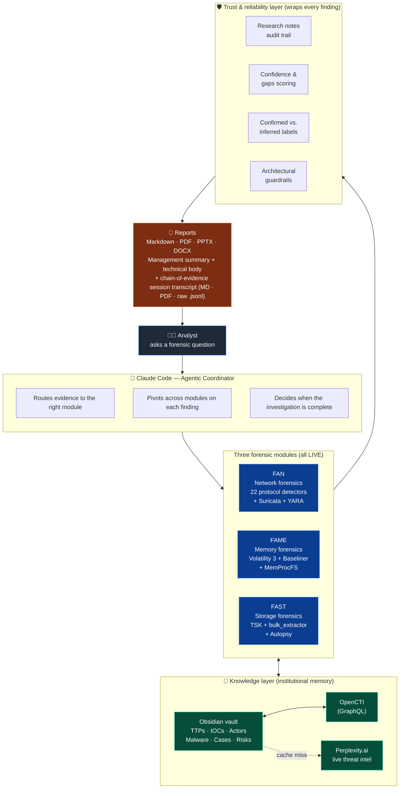
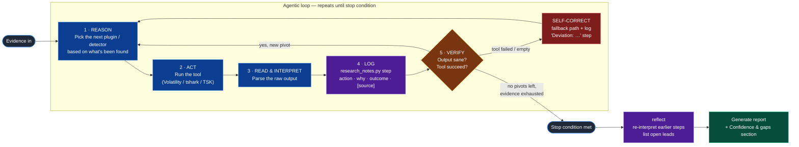
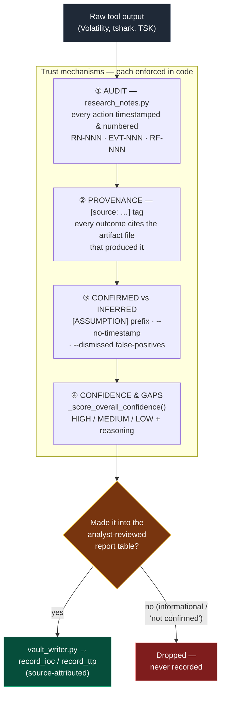
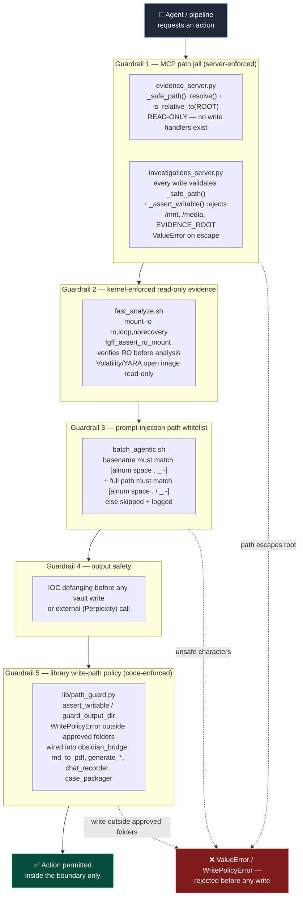
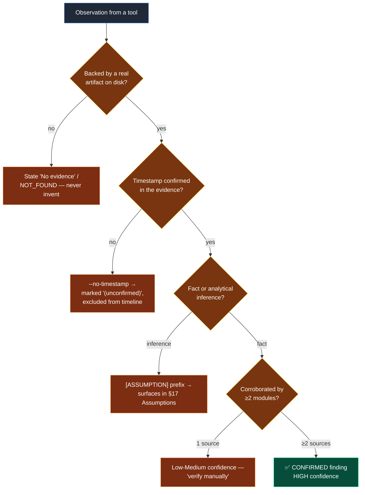
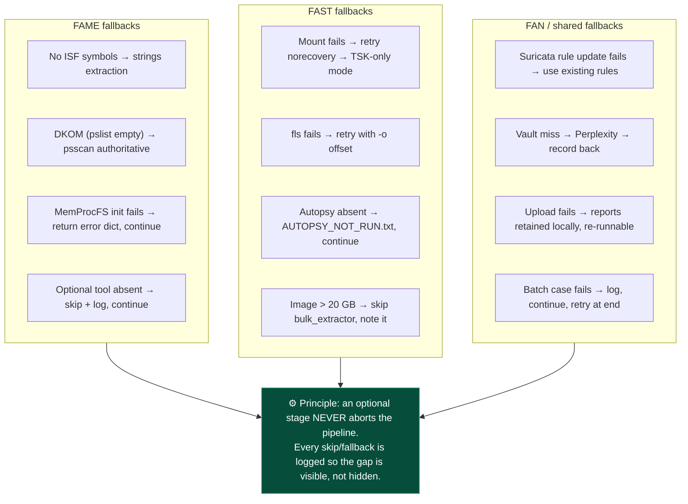
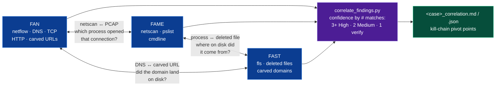
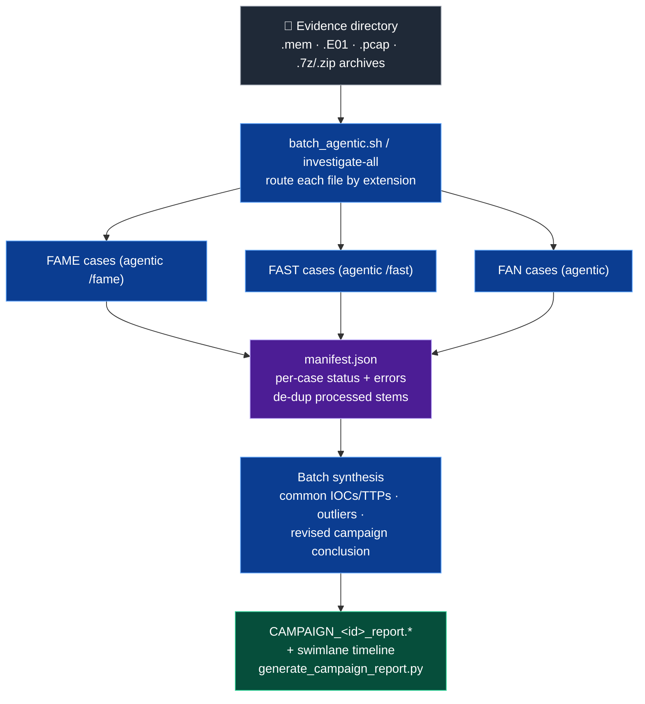

# FanGetFameFast — Architecture diagrams (presentation deck)

**Version:** 1.0 · June 2026
**Platform:** Ubuntu 24.04 LTS (x86-64)
**Authors:** Richard de Vries · Jeffrey Everling · Malin Janssen · Suzanne Maquelin
**Purpose:** Judge-facing architecture reference for the *FIND EVIL!* hackathon presentation.

> Every diagram in this file is written in [Mermaid](https://mermaid.js.org/). It renders
> natively in GitHub, the VS Code Markdown preview, and Obsidian — no build step. An ASCII
> fallback is provided for the two load-bearing diagrams so they read in a plain terminal too.
> Each diagram is annotated with the **judging criterion** it speaks to, so the panel can map
> what they see on screen to their scoring rubric.

---

## Table of contents

1. [One-slide system overview](#1-one-slide-system-overview)
2. [The agentic investigation loop (reason → act → verify → self-correct)](#2-the-agentic-investigation-loop)
3. [Trust & reliability layer](#3-trust--reliability-layer)
4. [Audit-trail traceability chain](#4-audit-trail-traceability-chain)
5. [Architectural guardrails — where security boundaries are enforced](#5-architectural-guardrails)
6. [Anti-hallucination pipeline (confirmed vs. inferred)](#6-anti-hallucination-pipeline)
7. [Failure handling & self-correction map](#7-failure-handling--self-correction-map)
8. [Cross-module correlation (the FAN ↔ FAME ↔ FAST conversation)](#8-cross-module-correlation)
9. [Batch / campaign scale-out](#9-batch--campaign-scale-out)
10. [Judging-criteria crosswalk](#10-judging-criteria-crosswalk)

---

## 1. One-slide system overview

> **Speaks to:** *Breadth & Depth*, *Usability*. The whole platform on one slide: three
> forensic modules, one agentic coordinator, a persistent knowledge graph, and a trust layer
> that wraps every finding.



**The one-sentence pitch:** *Every serious incident leaves traces in the network, in memory,
and on disk. A human can read each one. Nobody can correlate all three fast enough to matter
during a live incident. FanGetFameFast does — and it shows its work.*

---

## 2. The agentic investigation loop

> **Speaks to:** *Autonomous Execution Quality* — "Does the agent reason about next steps,
> handle failures, and self-correct in real time?" This is the heart of the submission.



**Why it matters to the judges:** the loop is *enforced*, not aspirational. The FAME/FAST/FAN
skills carry a **MANDATORY RULE**: *"Do NOT proceed to the next analysis step until the current
step has been documented via `research_notes.py step`."* Step 4 cannot be skipped. Self-correction
(the red box) is also mandatory — every deviation from the happy path is logged as its own
`step --title "Deviation: …"` entry, so the panel can see exactly where and why the agent changed course.

### ASCII fallback

```
            ┌──────────────────────────── agentic loop ────────────────────────────┐
            │                                                                       │
 evidence ─►│  REASON ─► ACT ─► READ ─► LOG(step) ─► VERIFY ─┬─ new pivot ──► REASON│
            │   pick     run    parse   action/why/  ok?     │                      │
            │   next    tool   output   outcome/     ────────┤                      │
            │   step                    [source]             └─ failed/empty ─►     │
            │                                                    SELF-CORRECT        │
            │                                                    (fallback + log     │
            │                                                     "Deviation: …") ─► │
            └───────────────────────────────────────────────────────────────────────┘
                                         │ no pivots left
                                         ▼
                              reflect ─► report + "Confidence & gaps"
```

---

## 3. Trust & reliability layer

> **Speaks to:** *IR Accuracy* and *Audit Trail Quality*. Every finding passes through four
> independent trust mechanisms before it reaches the report. None of them are prompt-only —
> each is backed by code in `lib/`.



**The anti-hallucination guarantee:** vault entries are derived **only** from the
analyst-reviewed report tables — never auto-scraped from raw tool output. A value an analyst
did not vet into the final report never becomes an institutional record. Rows explicitly marked
*"not confirmed"* or *Informational* are skipped by `vault_writer._parse_ioc_table()`.

---

## 4. Audit-trail traceability chain

> **Speaks to:** *Audit Trail Quality* — "Can judges trace any finding back to the specific tool
> execution that produced it?" **Yes — here is the unbroken chain.**

```mermaid
flowchart LR
    TOOL["🔧 Tool execution<br/>vol -f img.mem windows.pslist"]:::tool
    EVID["🗄️ Preserved artifact<br/>&lt;case&gt;_evidence/memory/pslist.txt<br/>(+ SHA-256)"]:::evid
    NOTE["📝 Research note<br/>RN-005 · timestamp · action ·<br/>why · outcome [source: pslist.txt]"]:::note
    REPORT["📄 Report section<br/>cites RN-005 + evidence path"]:::report
    VAULTREC["🧠 Vault record<br/>record_ttp(... 'source: FAME report, RN-005')"]:::vault

    TOOL -->|"output written to"| EVID
    EVID -->|"cited in"| NOTE
    NOTE -->|"rolls up into"| REPORT
    REPORT -->|"confirmed findings"| VAULTREC

    VAULTREC -.->|"trace back ⟲"| NOTE
    NOTE -.->|"trace back ⟲"| EVID
    EVID -.->|"trace back ⟲"| TOOL

    classDef tool fill:#0b3d91,stroke:#60a5fa,color:#fff
    classDef evid fill:#374151,stroke:#9ca3af,color:#fff
    classDef note fill:#4c1d95,stroke:#c4b5fd,color:#fff
    classDef report fill:#7c2d12,stroke:#fdba74,color:#fff
    classDef vault fill:#064e3b,stroke:#34d399,color:#fff
```



A judge can pick **any** IOC or TTP in the vault, read its `source: … RN-NNN` attribution, open the
matching research note, follow the `[source: …]` tag to the preserved artifact file, and re-run the
exact command in the `Action` field. The chain is bidirectional and complete.

Wrapping the whole chain is the **chain-of-evidence session transcript**
(`lib/chat_recorder.py` → `<case>_chat_transcript.{md,pdf,jsonl}`): a verbatim,
SHA-256-fingerprinted record of the entire Claude Code coordination session —
every analyst question, every pivot, every tool execution and its full output.
It is produced automatically at the end of each pipeline and shows not just
*what* was concluded but *how* the coordinator reasoned its way there.

### ASCII fallback

```
  TOOL RUN            ARTIFACT                RESEARCH NOTE          REPORT            VAULT
 ┌─────────┐  write  ┌──────────────┐  cite  ┌────────────┐  roll  ┌────────┐  conf. ┌──────────┐
 │ vol ... │ ──────► │ pslist.txt   │ ─────► │ RN-005      │ ─────►│ §x cites│ ─────►│ record_ttp│
 │ pslist  │         │ + SHA-256    │        │ action/why/ │  up    │ RN-005  │       │ source:   │
 └─────────┘         └──────────────┘        │ outcome     │       └────────┘       │ FAME,RN-05│
      ▲                     ▲                 │ [source:…]  │           ▲             └──────────┘
      └───────── trace back any finding ◄─────┴─────────────┴───────────┘
```

---

## 5. Architectural guardrails

> **Speaks to:** *Constraint Implementation* — "Are guardrails architectural or prompt-based?
> Where are security boundaries enforced?" **In code, at the server and kernel level — not in
> the prompt.**



**Test-for-bypass talking point:** the evidence MCP server has **no write handlers at all** — a
write is not "denied", it is *unimplemented*. Path traversal (`../../etc/passwd`) and sibling-prefix
escape (`evidence_exfil`) are rejected by `_safe_path()` because the resolved absolute path fails the
`Path.is_relative_to(EVIDENCE_ROOT)` containment check.
Evidence is mounted read-only at the **block-device level**, so even a bug in the pipeline cannot
modify the original image. And even a buggy `--output-dir` cannot land a report in evidence:
`lib/path_guard.py` hard-fails (`WritePolicyError`) any library write outside the approved output
folders, validated by `python3 lib/path_guard.py --test`.

---

## 6. Anti-hallucination pipeline

> **Speaks to:** *IR Accuracy* — "Hallucinations caught and flagged? Confirmed findings
> distinguished from inferences?"



Every branch that is *not* a confirmed fact is **visibly flagged** in the report rather than
silently dropped or silently asserted. The reader always knows the epistemic status of a claim.

---

## 7. Failure handling & self-correction map

> **Speaks to:** *Autonomous Execution Quality* — failure handling in real time.



Bash orchestrators run `set -euo pipefail` for fail-fast on *critical* steps, while *optional*
steps use `|| true` + a logged warning so a missing tool degrades gracefully. Python integrations
(`fame_memprocfs.py`, `perplexity_client.py`, `investigations_upload.py`) **return structured
error objects instead of raising**, so the coordinator sees the failure, logs it, and continues.

---

## 8. Cross-module correlation

> **Speaks to:** *Breadth & Depth* — the three modules interrogate each other.



A single suspicious network connection found by FAN asks FAME *which process opened it* and FAST
*what landed on disk*. The correlation engine assigns confidence by the **number of independent
modules** that corroborate the same pivot — a single-source artifact is explicitly tagged
*"verify manually"*, never auto-escalated.

---

## 9. Batch / campaign scale-out

> **Speaks to:** *Breadth & Depth* — "How much case data can the agent handle?"



The manifest records every case outcome and de-duplicates already-processed stems, so an
interrupted batch resumes without re-analyzing completed evidence.

---

## 10. Judging-criteria crosswalk

| Judging criterion | Where it lives in this deck | Where it lives in the code |
|-------------------|-----------------------------|----------------------------|
| **Autonomous Execution Quality** | §2 agentic loop, §7 failure map | FAME/FAST/FAN skills (mandatory step + deviation logging); fallback chains in `fast_analyze.sh`, `fame_memprocfs.py` |
| **IR Accuracy** | §3 trust layer, §6 anti-hallucination | `_score_overall_confidence()`, `[ASSUMPTION]`/`--no-timestamp`/`--dismissed` in `research_notes.py`; `vault_writer._parse_ioc_table()` confirmed-only rule |
| **Breadth & Depth** | §1 overview, §8 correlation, §9 batch | 22 FAN detectors + FAME + FAST; `correlate_findings.py`; `batch_agentic.sh` |
| **Constraint Implementation** | §5 guardrails | `_safe_path()` in both MCP servers; `lib/path_guard.py` write-path policy (`WritePolicyError`) + `scripts/pathguard.sh`; read-only mount; filename whitelist in `batch_agentic.sh` |
| **Audit Trail Quality** | §4 traceability chain | `research_notes.py` (RN/EVT/RF IDs); preserved `<case>_evidence/` + SHA-256; source attribution in `vault_writer.py` |
| **Usability & Documentation** | This file + [User Guide](USER_GUIDE.md), [Deployment Guide](DEPLOYMENT_GUIDE.md), [Technical Reference](TECHNICAL_REFERENCE.md) | One-command pipelines; dev-container; self-tests |

---

## Related documentation

| Document | Purpose |
|----------|---------|
| [User Guide](USER_GUIDE.md) | Day-to-day operation, every command, the trust features in operator language |
| [Deployment Guide](DEPLOYMENT_GUIDE.md) | Production setup, hardening, the guardrails as a security control |
| [Technical Reference](TECHNICAL_REFERENCE.md) | Full architecture, pipeline data flows, library API, the trust/reliability subsystem in depth |
| [CLAUDE.md](../CLAUDE.md) | Coordinator philosophy, report voice registers, evidence constraints |

---

*Richard de Vries · Jeffrey Everling · Malin Janssen · Suzanne Maquelin — June 2026 — Architecture deck v1.0*
